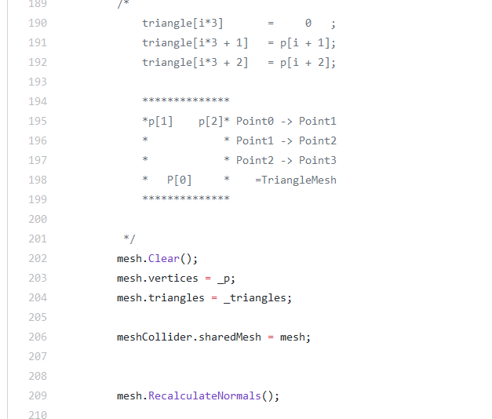
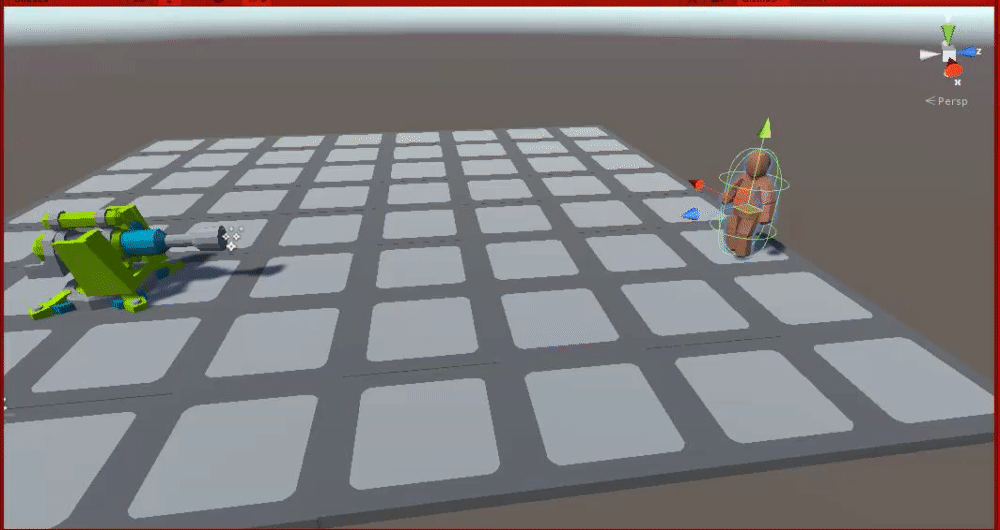
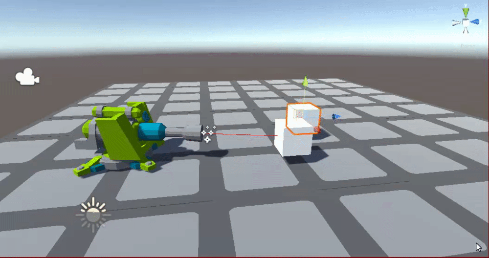
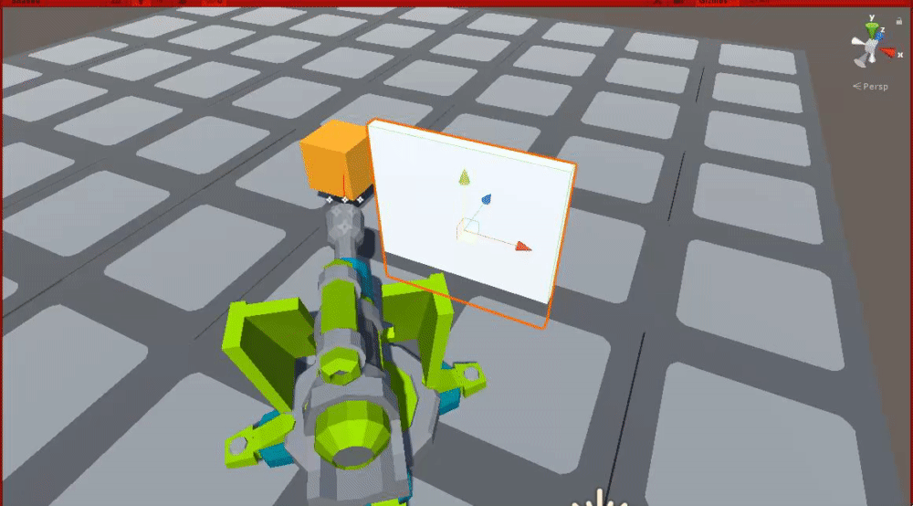
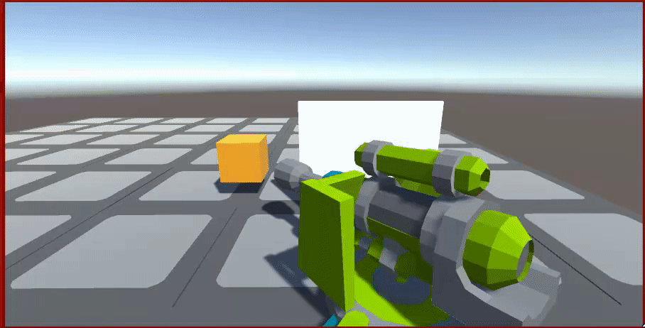

~ Unity-Candies ~
===================================
A Simple space filled with personal work and study lessons.
These mainly help me design, improvements and manage growth,
original works are in a private GitHub.

~ The Candy Bag ~
===================================

## Mesh & Shaders
> <--It's gone-->

## Shooting Beavhiour Script/Editor

| Time |                    Pictures                    | Desc.                                                |
| :--- | :--------------------------------------------: | :--------------------------------------------------- |
| 1h   |        | Getting the prefabs and ressources                   |
| 2h   |      | Targets - [Closest, Furthest, First, Last]           |
| 30m  |  | Little perfecting                                    |
| 1h   |    | The Factory works...*cough*                          |
| 2h   |     | The shooting works but..*cough*.. the Pool however.. |

# TO DO
### Fixes -
- [ ] ...
### Content -
- [ ] Add Rotation at t[0..1] on an Arc
- [x] Implement ProjectileData for ProjectilesFactories and FireMode
- [ ] Make a new Displacement - Boomerang -
- [ ] Make a new Displacement - Head seek -
- [ ] Code the OnCollisionProjectile / OnDestroyProjectile Delegate
- [ ] Make a new Projectile - BeeHive -
- [ ] ...

## Placement Script/Editor

| Time |                      Pictures                    | Desc.                                                |
| :--- |   :--------------------------------------------: | :--------------------------------------------------- |
| 4h   || Getting the research done, & plan                    |
| 2h   || add Rotation + fixes                                 |

# TO DO
### Fixes -
- [ ] Re-initialise the rotation once isGrounded gets taken off in editor
- [ ] ...
### Content -
- [ ] Make it snap in different directions
- [ ] Make it snap in *Multiple* different directions
- [ ] ...

## Acknowledgments
* Hat tip to the power of internet and free knowledge
* Inspiration
* Every youtuber/Streamer I type along (Never ever copy pasted)